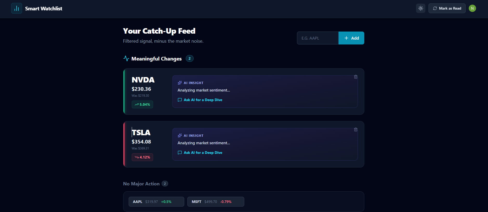
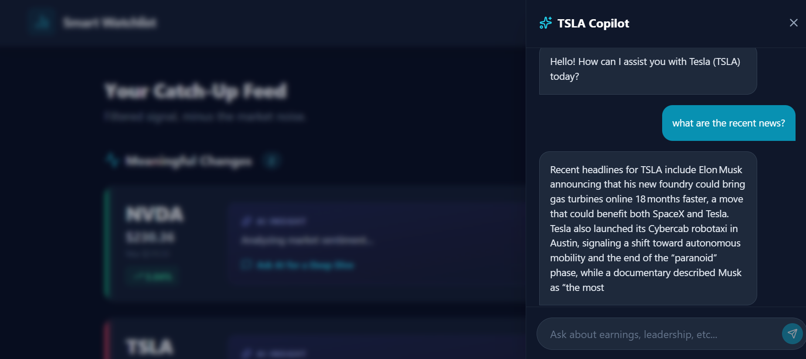
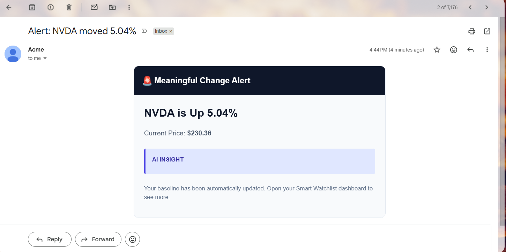
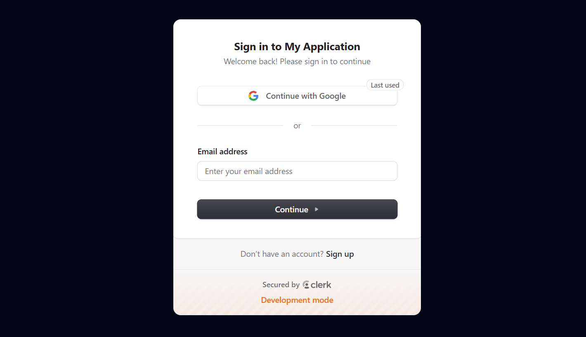

# CatchUp: The Smart Market Watchlist 📈
> **AI-Driven Signal Over Noise. An "Inbox Zero" approach to market tracking.**

Standard market watchlists are broken. They overwhelm users with endless walls of flashing green and red numbers, forcing retail investors to manually sift through charts and news articles to figure out *why* a stock moved. 

**CatchUp** is an intelligent, event-driven market dashboard that separates the signal from the noise. It utilizes a Quantitative Delta Engine and a Retrieval-Augmented Generation (RAG) AI agent to calculate what has "meaningfully changed" since your last visit, providing instant context so you can make informed decisions in seconds.

---

## 📸 Project Snapshots

### 1. The Dashboard (Signal vs. Noise)
*The main view intelligently categorizes stocks based on your personalized last-seen price. It highlights significant movers (>3% delta) and suppresses low-volatility noise.*

### 2. Deep Dive AI Copilot
*An interactive, slide-out drawer where users can interrogate a stock-specific AI agent. The AI is fed live Yahoo Finance news to prevent hallucinations and provide accurate catalyst explanations.*

### 3. Proactive Background Alerts
*A Python cron-worker runs 24/7 in the background, continuously monitoring user portfolios and dynamically routing HTML email alerts when a threshold is crossed.*

### 4. Multi-Device Authentication
*Enterprise-grade JWT authentication ensures your baseline prices and preferences are perfectly synced, whether you are logging in from a phone or a desktop.*

---

## ✨ Key Features

* **Quantitative Delta Engine:** Filters out minor daily fluctuations by comparing current market prices against a user's isolated `last_seen_price` baseline in the database.
* **AI Context Generation:** For every meaningful movement, the FastAPI backend fetches live market news and leverages Groq's `gpt-oss-20b` model to generate a one-sentence catalyst summary.
* **Proactive Email Routing:** An APScheduler background job cross-references database triggers with Clerk's API to dynamically resolve user emails and dispatch Resend alerts.
* **Stock-Specific RAG Chat:** A dedicated AI chat interface that isolates queries to a specific ticker's recent news context.
* **Secure State Synchronization:** Fully tokenized session management utilizing Clerk's React and Python SDKs.

---

## 🛠️ Technology Stack

### Frontend
* **Framework:** React + Vite
* **Styling:** Tailwind CSS (Custom Dark/Light Themes)
* **Icons:** Lucide-React
* **HTTP Client:** Axios

### Backend
* **Framework:** FastAPI (Python)
* **Database & ORM:** SQLite + SQLAlchemy
* **Task Scheduling:** APScheduler
* **Market Data:** `yfinance`

### Third-Party APIs
* **LLM Inference:** Groq
* **Authentication:** Clerk
* **Transactional Email:** Resend

